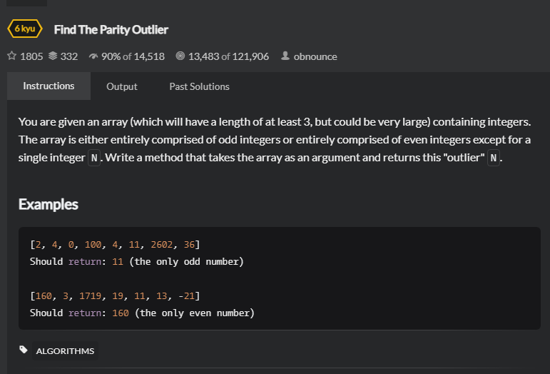

# FindOutlier
## 题目
 - [FindOutlier | codewars](https://www.codewars.com/kata/5526fc09a1bbd946250002dc/train/java) 

 - Title
   ``` 
   You are given an array (which will have a length 
   of at least 3, but could be very large) containing integers. 
   The array is either entirely comprised of odd 
   integers or entirely comprised of even integers except 
   for a single integer N. Write a method that takes the
    array as an argument and returns this "outlier" N.
 - Examples
   ```angular2html
   [2, 4, 0, 100, 4, 11, 2602, 36]
   Should return: 11 (the only odd number)

   [160, 3, 1719, 19, 11, 13, -21]
   Should return: 160 (the only even number)
   ```
 - 思路
    ```
   判断整个数组中偶数和奇数的个数，根据个数去判断应该返回那个值
