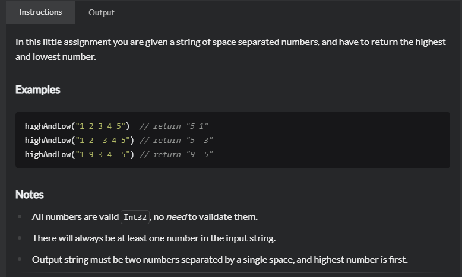

# Kata
## 题目
 - [Highest and Lowest | codewars](https://www.codewars.com/kata/554b4ac871d6813a03000035/train/java)
   
 - Title
   
   In this little assignment you are given a string of space separated numbers, and have to return the highest and lowest number.
 
 - Examples
    
     ```
     highAndLow("1 2 3 4 5")  // return "5 1"
     highAndLow("1 2 -3 4 5") // return "5 -3"
     highAndLow("1 9 3 4 -5") // return "9 -5"
   ```
 - 思路
     
   将字符串使用split()分割成String类型数组，转换成Int类型数组在排序，输出最后一个和第一个