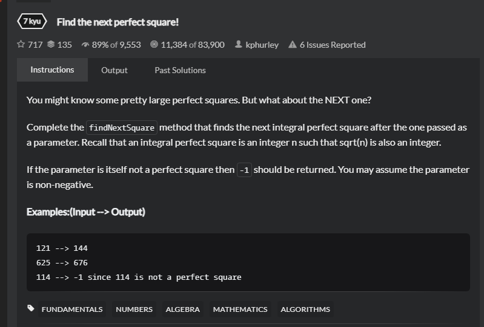

# findNextSquare
## 题目

- [Find the next perfect square! | Codewars](https://www.codewars.com/kata/56269eb78ad2e4ced1000013/train/java)
 
- Title
   You might know some pretty large perfect squares. But what about the NEXT one?

    Complete the findNextSquare method that finds the next integral perfect square after the one passed as a parameter. Recall that an integral perfect square is an integer n such that sqrt(n) is also an integer.

    If the parameter is itself not a perfect square then -1 should be returned. You may assume the parameter is non-negative.
- Examples
  ```
    121 --> 144
    625 --> 676
    114 --> -1 since 114 is not a perfect square
  ```
- 思路
   本题较为简单，将传入的数值求平方根，判断是否为整数，为整数就加上1求平方并返回，否则返回-1.