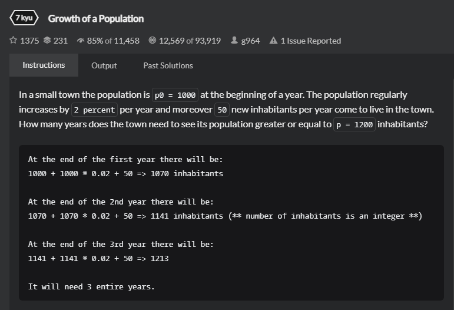

# Arge
## 题目
- [Growth of a Population | codewars](https://www.codewars.com/kata/563b662a59afc2b5120000c6/train/java)
  
- Title
  In a small town the population is p0 = 1000 at the beginning of a year. The population regularly increases by 2 percent per year and moreover 50 new inhabitants per year come to live in the town. How many years does the town need to see its population greater or equal to p = 1200 inhabitants?
- Examples
   ```
  At the end of the first year there will be: 
  1000 + 1000 * 0.02 + 50 => 1070 inhabitants

  At the end of the 2nd year there will be:
  1070 + 1070 * 0.02 + 50 => 1141 inhabitants (** number of inhabitants is an integer **)

  At the end of the 3rd year there will be:
  1141 + 1141 * 0.02 + 50 => 1213

  It will need 3 entire years.
  ```
- 思路
   本题较为简单，思路从简，一个循环就可以解决。