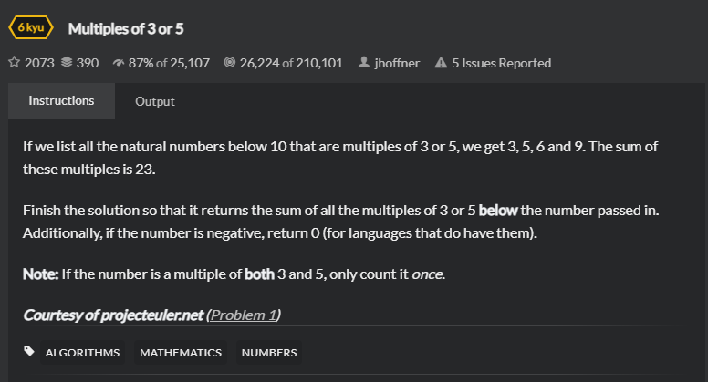

# Solution
## 题目
- [Multiples of 3 or 5 | CodeWars](https://www.codewars.com/kata/514b92a657cdc65150000006/train/java)
   
- Title
  
    If we list all the natural numbers below 10 that are multiples of 3 or 5, we get 3, 5, 6 and 9. The sum of these multiples is 23.

    Finish the solution so that it returns the sum of all the multiples of 3 or 5 below the number passed in. Additionally, if the number is negative, return 0 (for languages that do have them).

    Note: If the number is a multiple of both 3 and 5, only count it once.
- Examples
    ```angular2html
    10 ---> 23
    ```
- 思路
   
  遍历一下数字，判断是否为3或5的倍数，进行累加。