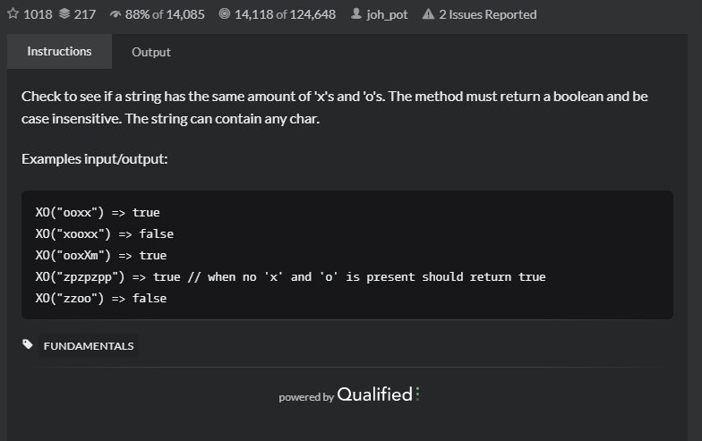

# Exes and Ohs
## 题目
- [Exes and Ohs | CodeWars](https://www.codewars.com/kata/55908aad6620c066bc00002a/train/java)
   
- Title

  Check to see if a string has the same amount of 'x's and 'o's. The method must return a boolean and be case insensitive. The string can contain any char.
- Examples
   ```angular2html
    XO("ooxx") => true
    XO("xooxx") => false
    XO("ooxXm") => true
    XO("zpzpzpp") => true // when no 'x' and 'o' is present should return true
    XO("zzoo") => false
    ```
- 思路
   
    统计字符串串中每个字符的数量，然后比较后返回