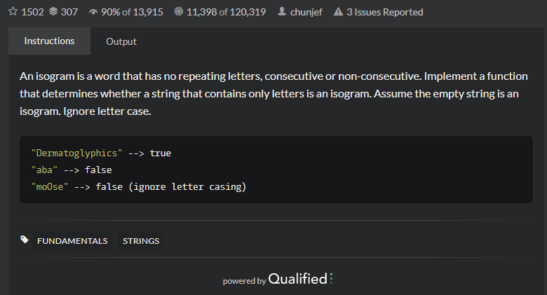

# Isograms
## 题目
- [Isograms | CodeWars](https://www.codewars.com/kata/54ba84be607a92aa900000f1/train/java)
  
- Title

  An isogram is a word that has no repeating letters, consecutive or non-consecutive. Implement a function that determines whether a string that contains only letters is an isogram. Assume the empty string is an isogram. Ignore letter case.
- Examples
   
   ```angular2html
    "Dermatoglyphics" --> true
    "aba" --> false
    "moOse" --> false (ignore letter casing)
   ```
-思路
    本题将收到的字符串转换成数组放到set中，通过一个循环很快得出结论