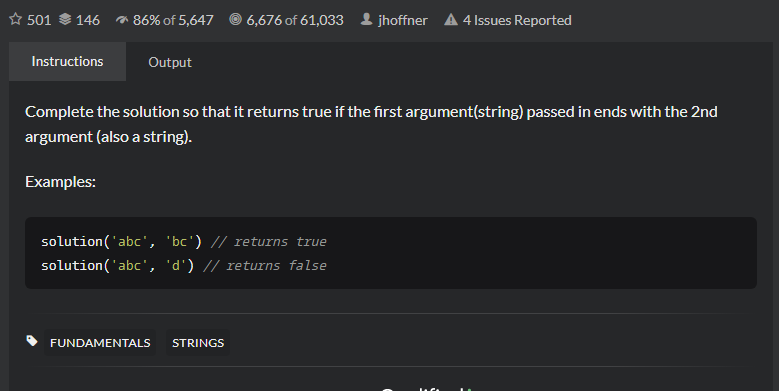

# String ends with?
#  题目
- [String ends with? | CodeWars](https://www.codewars.com/kata/51f2d1cafc9c0f745c00037d/train/java)
   
- Title

  Complete the solution so that it returns true if the first argument(string) passed in ends with the 2nd argument (also a string).
- Examples
  
   ```angular2html
   solution('abc', 'bc') // returns true
   solution('abc', 'd') // returns false
   ```
- 思路
   
   略
