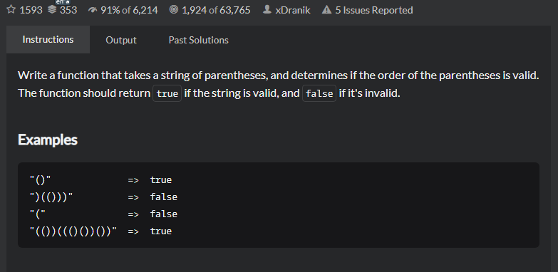

# Valid Parentheses
## 题目
- [Valid Parentheses | CodeWars](https://www.codewars.com/kata/52774a314c2333f0a7000688/train/java)
   
- Title

  Write a function that takes a string of parentheses, and determines if the order of the parentheses is valid. The function should return true if the string is valid, and false if it's invalid.
-Examples
  ```angular2html
    "()"              =>  true
    ")(()))"          =>  false
    "("               =>  false
    "(())((()())())"  =>  true
   ```
  
- 思路
   
   利用栈的特性就可以很好解决这个问题