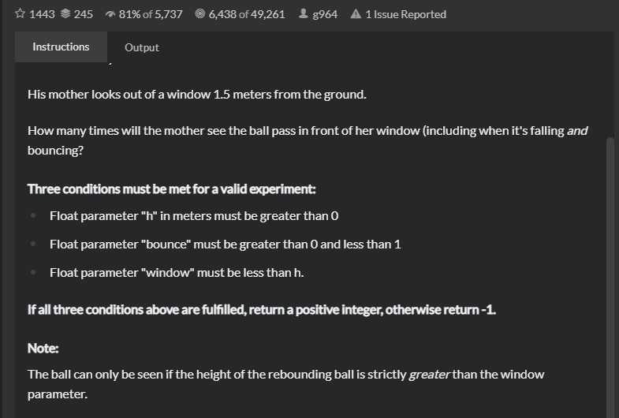

#Bouncing Balls
## 题目
- [Bouncing Balls|CodeWars](https://www.codewars.com/kata/5544c7a5cb454edb3c000047/train/java)
  
- Title

  His mother looks out of a window 1.5 meters from the ground.

    How many times will the mother see the ball pass in front of her window (including when it's falling and bouncing?

    Three conditions must be met for a valid experiment:
    Float parameter "h" in meters must be greater than 0
    Float parameter "bounce" must be greater than 0 and less than 1
    Float parameter "window" must be less than h.
    If all three conditions above are fulfilled, return a positive integer, otherwise return -1.

   Note:
     
    The ball can only be seen if the height of the rebounding ball is strictly greater than the window parameter.
- Examples
   ```angular2html
    
     - h = 3, bounce = 0.66, window = 1.5, result is 3

     - h = 3, bounce = 1, window = 1.5, result is -1

     (Condition 2) not fulfilled).
  ```
- 思路
    
    通过分析可以很快发现这个次数其实就是2*bounce+1的值，所以我们去求对数来获得这个答案