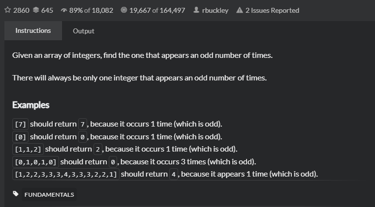

# Find the odd int
## 题目
- [Find the odd int | CodeWars](https://www.codewars.com/kata/54da5a58ea159efa38000836/train/java)
  
- Title

  Given an array of integers, find the one that appears an odd number of times.

  There will always be only one integer that appears an odd number of times.

- Examples
    
    ```angular2html
    [7] should return 7, because it occurs 1 time (which is odd).
    [0] should return 0, because it occurs 1 time (which is odd).
    [1,1,2] should return 2, because it occurs 1 time (which is odd).
    [0,1,0,1,0] should return 0, because it occurs 3 times (which is odd).
    [1,2,2,3,3,3,4,3,3,3,2,2,1] should return 4, because it appears 1 time (which is odd).
   ```
- 思路
    
    为偶数次数的整数异或最后结构为0，为奇数次数的整数异或以后的其本身