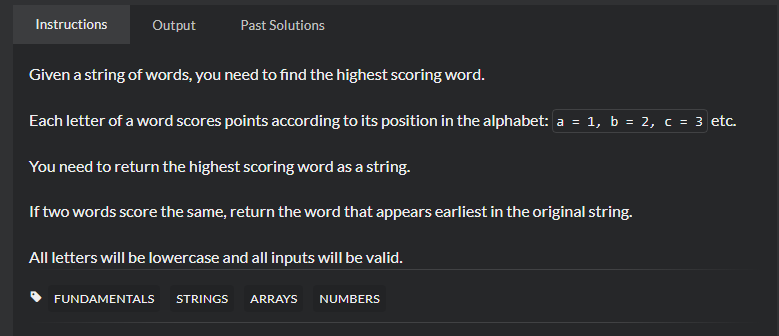

# Highest Scoring Word
## 题目
 - [Highest Scoring Word | CodeWars](https://www.codewars.com/kata/57eb8fcdf670e99d9b000272/train/java)
    
 - Title

   Given a string of words, you need to find the highest scoring word.

    Each letter of a word scores points according to its position in the alphabet: a = 1, b = 2, c = 3 etc.

    You need to return the highest scoring word as a string.

    If two words score the same, return the word that appears earliest in the original string.

    All letters will be lowercase and all inputs will be valid.
 - 思路
    
    利用for循环可以很快得出答案