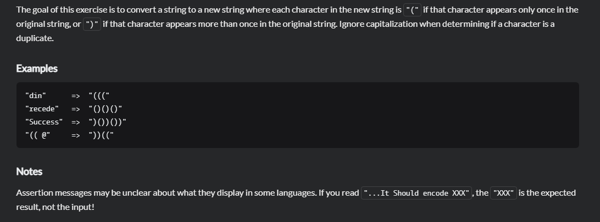

# DuplicateEncoder
## 题目
 - [DuplicateEncoder | CodeWars](https://www.codewars.com/kata/54b42f9314d9229fd6000d9c/train/java)
  
   
 - Title

   The goal of this exercise is to convert a string to a new string where each character in the new string is "(" if that character appears only once in the original string, or ")" if that character appears more than once in the original string. Ignore capitalization when determining if a character is a duplicate.
 
 - Example
 
   ```aidl
   "din"      =>  "((("
   "recede"   =>  "()()()"
   "Success"  =>  ")())())"
   "(( @"     =>  "))((" 
   ```
 - 思路
   记录下出现两次以上的字符然后将出现两次以上的字符变成），没出现两次的就变成（,最后返回结果

 - 最优解
   ```aidl
        public class DuplicateEncoder {
            static String encode(String word){
            word = word.toLowerCase();
            String result = "";
            for (int i = 0; i < word.length(); ++i) {
                char c = word.charAt(i);
                result += word.lastIndexOf(c) == word.indexOf(c) ? "(" : ")";
            }
            return result;
            }
        }
   ```
  