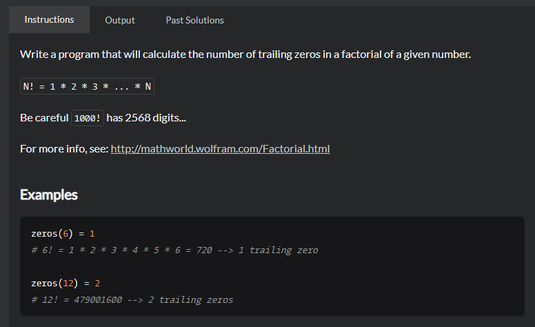

# Number of trailing zeros of N!
## 题目
 - [Number of trailing zeros of N! | CodeWars](https://www.codewars.com/kata/52f787eb172a8b4ae1000a34/train/java)
  
   
 - Title

   Write a program that will calculate the number of trailing zeros in a factorial of a given number.

    N! = 1 * 2 * 3 * ... * N

    Be careful 1000! has 2568 digits...

 - Examples

   ```aidl
    zeros(6) = 1
    # 6! = 1 * 2 * 3 * 4 * 5 * 6 = 720 --> 1 trailing zero

    zeros(12) = 2
    # 12! = 479001600 --> 2 trailing zeros
   ```
 