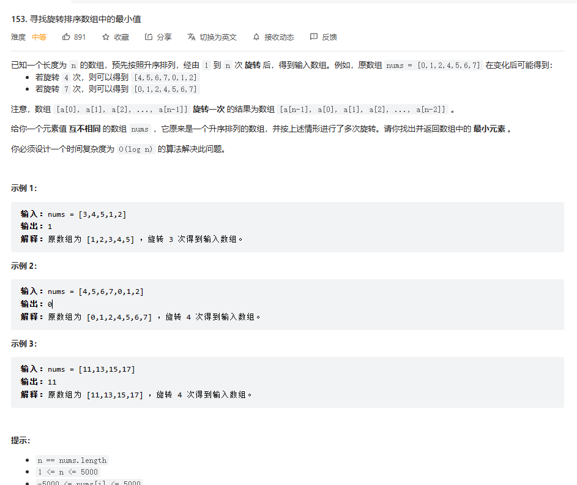

#FindMinimum
##题目

###解题思路
1. 因为是有序数组 所以如果可以根据二分法查找中间的指标
2. 将其与最左边和最右边进行比较，其中有3个返回条件
   1. 当其中间标志既小于数组right 又大于数组left 代表数组顺序没有进行变化 直接进行返回 示例 [11,13,14,15,17]
   2. 当中间标志大于左边 也大于右边 则最小值一定会在右边 所以直接将left置为index 示例 [3,4,5,1,2] [3,4,5,6,7,1,2]
   3. 当中间标志小于左边 也小于右边 则最小值一定在左边 所以直接将right置为index 示例 [3,4,5,-1,0,1,2]
   4. 如果只相差一个数字 则直接判断谁是最小值