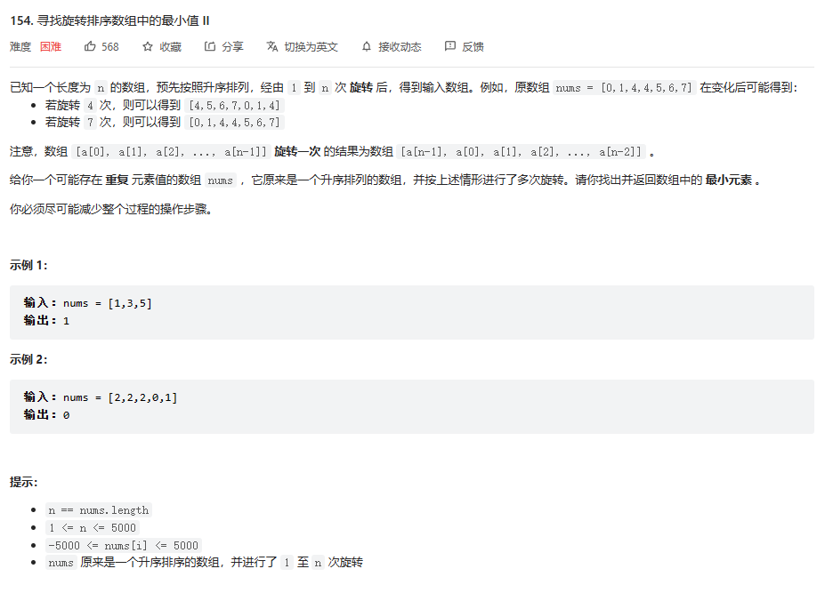

#FindMinimumⅡ
##题目

###解题思路
1. 因为是有序数组 所以如果可以根据二分法查找中间的指标
2. 当中间与右边相等 则去掉nums[right]数据 下一轮搜索空间为 [left, right-1]
3. 如果中间值小于右边 则最小值必然在最左边 下一轮搜索空间为[left,index]
4. 如果中间值小于右边 则去掉nums[left]数据 下一轮搜索空间为[left+1, right]