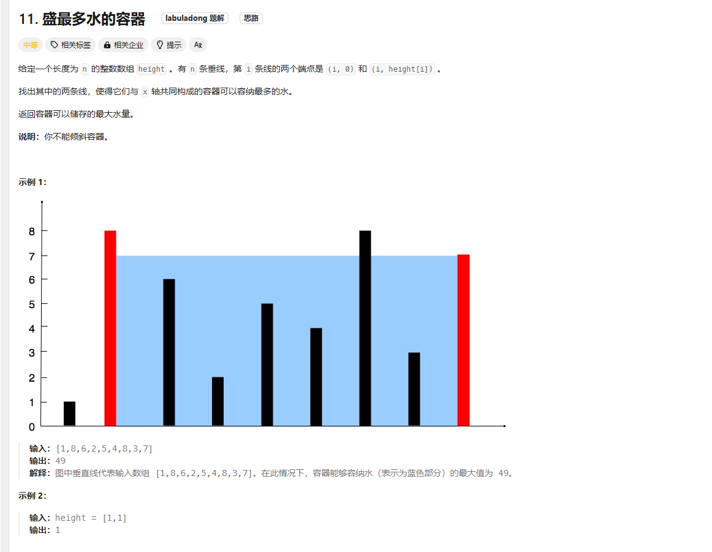

# Container With Most Water

## 题目


### 解题思路 暴力穷举
1. 我第一时间想到的就是暴力穷举，首先遍历第一个数组，其中最后一个元素不做遍历
2. 随后遍历第二个数组 开头j是从第一个数组的i+1开始的，会遍历最后一个数组
3. 其中的length = j - i; width = Math.min(height[i], height[j]);
4. 随后max = length * width;  最后取最大的值

### 时间复杂度
O(n^2) 超时长了， 只能用双指针了 但是长和宽还是这么算的

### 解题思路2 双指针法
1. 把j = len - 1; i = 0;
2. 然后做循环， 只要i < j; 就可以一直做
3. 最后我们该如何判断什么时候该i++ , j--呢
4. 根据height[i]和height[j]的大小去算，因为这个length必然会减少的 
5. 所以如果想要保证取到最大的那个值， 只能是哪个值小，哪个值往对面靠
6. ``` 
            if (height[i] < height[j]) {
                i++;
            }
            else {
                j--;
            }
   ```
   
### 时间复杂度
O(n)