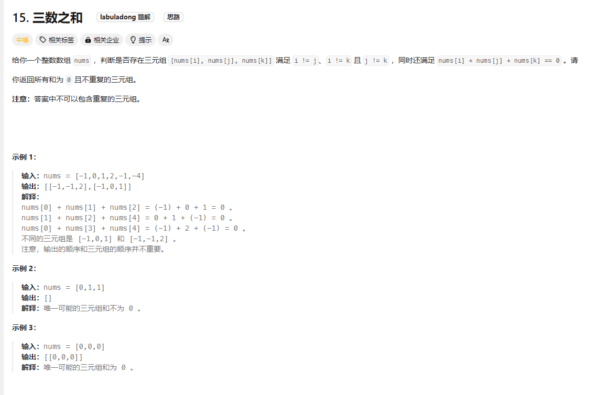

# Three Sum

## 题目

### 解题思路 双指针
1. 首先将数组排序
2. 将数组进行遍历， 如果第一个数大于0，则直接返回空
3. 将后面的数与前面一位进行比较 如果相同 则不需要重新进行判断 
4. 定义两个指针， 一个是i + 1 一个是 len - 1分别为L和R
5. 这样就可以转到2数之合来 然后进行循环遍历
6. 最后得出不同的数组，然后进行返回

时间复杂度 O(n^2)