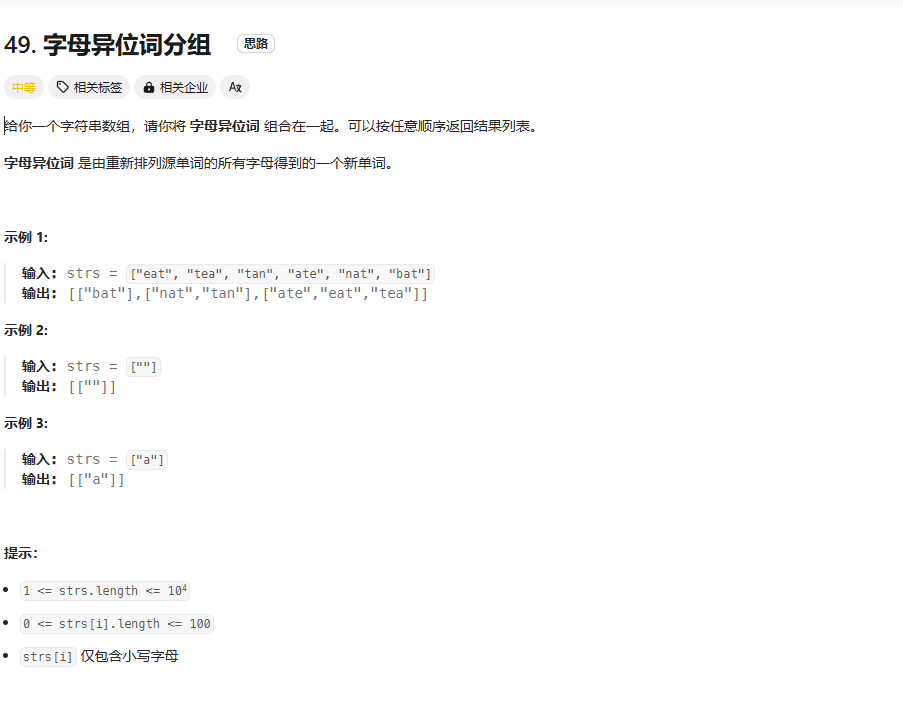

# Group Anagrams

## 题目描述

### 解题思路

1. 先将字符串排序，然后将排序后的字符串作为key，字符串本身作为value，存入HashMap中。
2. 遍历HashMap，将value按字母顺序排序，然后存入ArrayList中。
3. 返回ArrayList。

时间复杂度：O(nlogn)，排序的时间复杂度为O(nlogn)，HashMap的存取时间复杂度为O(1)，所以总时间复杂度为O(nlogn)。