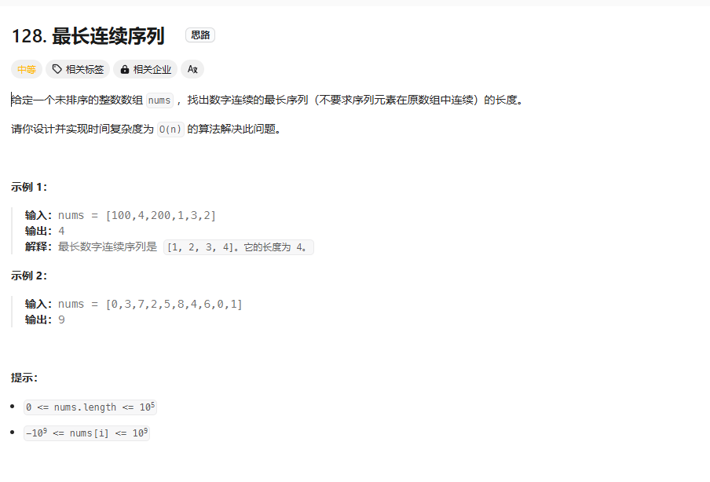

# Longest Consecutive Sequence
## 题目描述

### 解题思路1：暴力法
1. 首先把数组进行排序
2. 排序后，我们可以发现，如果一个数和它后面的数相差为1，那么这两个数之间一定有着连续的数。
3. 如果两个数相同，则continue
4. 如果相差大于1，则说明这两个数之间没有连续的数，我们需要记录下这个数，然后继续往后找。
5. 记录下最大的连续序列长度。
6. 最后返回最大的连续序列长度。

### 复杂度分析
- 时间复杂度：O(nlogn)

### 解题思路2：哈希表
1. 我们可以用一个哈希表来记录数组中出现过的数字
2. 然后遍历数组，对于每个数字，我们可以判断它是否在哈希表中
3. 如果在，则说明它和它后面的数字之间有连续的数字，我们可以记录下这个连续序列的长度。
4. 如果数字不在哈希表中，则说明它和它后面的数字之间没有连续的数字，我们可以记录下这个数字然后继续往后找。
5. 记录下最大的连续序列长度。
6. 最后返回最大的连续序列长度。

### 复杂度分析
- 时间复杂度：O(n)

