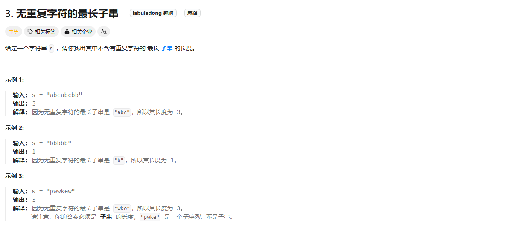

# Longest Substring Without Repeating Characters

## 题目

### 解题思路
1. 首先我肯定是想通过map去判断是否有重复的值， 并且定义一个左边开始的下标
2. 遍历这个string字符串，随后进行判断
3. 如果map已经存在这个字符，则这个下标得重新开始计算，并且为之前重复的下标后面那个为开始的字符，定为map.get(chars[i] + 1)
4. 最后比较最大值，最大值的定义肯定是当前的位置 - 开始的位置 + 1； 所以为 i - left + 1;